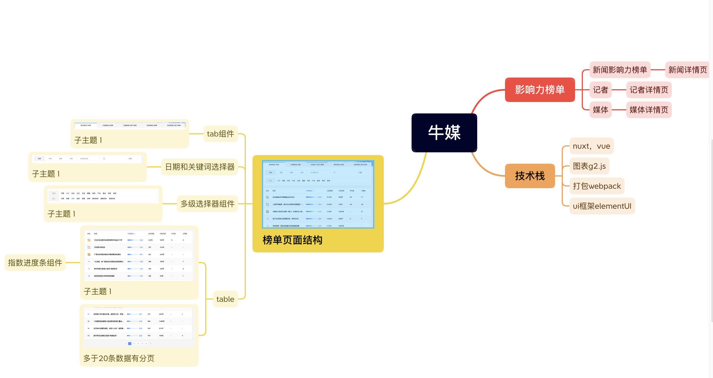

# 牛媒页面

## 需求分析

主要实现首页的静态页面，其他的类似，可以复用组件组成




## 搭载项目

### 使用npx创建项目

```bash
npx create-nuxt-app <项目名>
```

### 启动项目

```bash
# install dependencies
$ npm install

# serve with hot reload at localhost:3000
$ npm run dev

# build for production and launch server
$ npm run build
$ npm run start

# generate static project
$ npm run generate
```

### 打包部署

打包出来dist目录，使用静态部署，申请阿里oss存储上传文件，结果部署不了静态页，需要绑定域名。转而用GitHub Page，设置后发现文件404，发现需要修改目录，改为doc目录，也是一样。遂参考 [Nuxt3 通过 Github Action 部署 Github Pages 的最佳实践](https://juejin.cn/post/7352797634556395535) 文章，构建自动化部署。

### 静态页地址

```bash
https://pai123456.github.io/mediaBeer/
```
